# List1

### 알고리즘의 개요

- 알고리즘이란? 유한한 단계를 통해 문제를 해결하기 위한 절차나 방법
  - 컴퓨터용어로 쓰이며, 컴퓨터가 어떤 일을 수행하기 위한 단계적 방법
  - 어떠한 문제를 해결하기 위한 절차

- 알고리즘 표현법
  1. 슈도코드
     - 특정 프로그래밍 언어의 문법에 따라 쓰여진 것이 아니라, 일반적인 언어로 코드를 흉내 내어 알고리즘을 써 놓은 코드
     - 의사 코드로 흉내만 내는 코드
     - 실제적인 프로그래밍 언어로 작성된 코드처럼 컴퓨터에서 실행할 수 없음
     - 특정 언어로 프로그램을 작성하기 전에 알고리즘을 대략적으로 모델링하는 데에 쓰임
  2. 순서도
     - 프로그램이나 작업의 진행 흐름을 순서에 따라 여러 가지 기호나 문자로 나타낸 도표
     - 흐름도, 프로그램의 논리적인 흐름, 데이터의 처리 과정을 표현하는 데 사용
     - 프로그램을 작성하기 전에 프로그램의 전체적임 흐름과 과정 파악을 위해 필수적으로 거쳐야 되는 작업

- 무엇이 좋은 알고리즘인가?

|     분류      |                      목표                      |
| :-----------: | :--------------------------------------------: |
|    정확성     |          얼마나 정확하게 동작하는가?           |
|    작업량     | 얼마나 적은 연산으로 원하는 결과를 얻어내는가? |
| 메모리 사용량 |        얼마나 적은 메모리를 사용하는가?        |
|    단순성     |                얼마나 단순한가?                |
|    최적성     |    더 이상 개선할 여지 없이 최적화되었는가?    |

- 알고리즘의 성능 분석 필요

  - 알고리즘의 성능 분석 기준으로 알고리즘의 작업량을 비교

  - 실제 걸리는 시간을 측정 (실행되는 환경에 따라 달라짐)
  - 실행되는 명령문의 개수를 계산 (많이 사용되는 방법)

## ✨시간 복잡도 = 빅-오(O) 표기법✨

- 시간 복잡도 함수 중에서 가장 큰 영향력을 주는 n에 대한 항만을 표시
- 계수(Coefficient)는 생략하여 표시
  - ex) O(2n + 1) = O(n)  O(4) = O(1)
- 요소 수가 증가함에 따라 각기 다른 연산 수를 보임

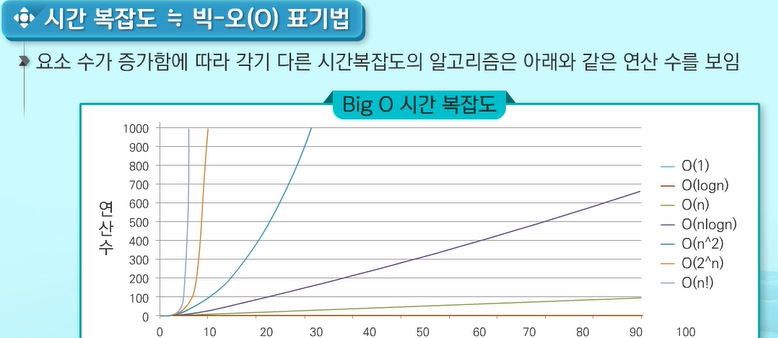

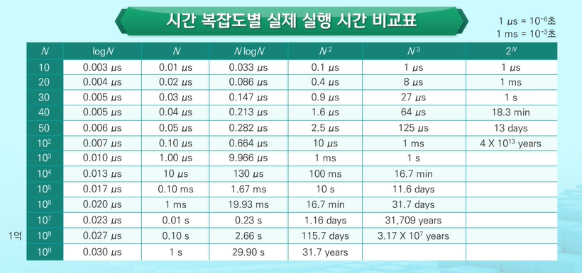


- 파이썬: 1991년 귀도 반 로섬이 개발한 프로그래밍 언어
  - 인터프리터 언어로 독립적인 플랫폼(느린 단점이 있지만, 어느 플랫폼에서도 실행 가능)
  - 객체지향
  - 파이썬 재단은 파이썬3를 권장
  - IoT분야의 라즈베리파이, 최근 빅데이터의 자료분석 등에서 파이썬의 관심이 높아짐
    - 프로그램 실행 속도에 관심 집중
      - 하드웨어 성능이 좋지 않던 시기에는 프로그램의 실행 속도가 크게 차이 남
    - 개발 시간 단축에 관심 집중
      - 하드웨어의 성능 개선으로 실행 속도의 차이가 크지 않음
      - 더 쉽게, 더 빨리 개발하는 것이 관심이 쏠려 파이썬 사용량이 늠✨
- 변수
  - 파이썬에서는 모든 자료는 객체
    - Java나 C에서 사용되는 기본형 타입 변수도 파이썬에서는 객체
  - 변수의 선언은 따로 없음
    - 변수에 값을 초기화 시 변수가 메모리에 생성
  - 하나의 변수에 다른 타입의 값을 변수에 저장할 수 있음

- 정수는 메모리가 허용하는 한 거의 무한대에 가깝게 설정할 수 있음
  - 천문학적인 수를 다루는 학문에서 파이썬을 선호

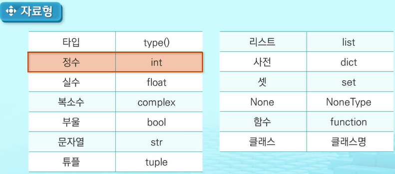

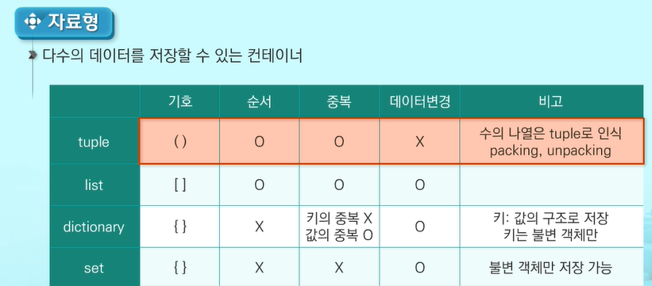

- Dictionary와 set은 해시 기법을 활용함
  - set은 순서가 없으므로 slicing과 indexing이 불가능
- 해시 테이블?
  - set이나 dictionary에 값이 입력되는 해당 값은 해시 함수를 통해 해시로 변환되고 저장소에 저장된다. 리스트처럼 앞에서부터 일련의 과정을 거치는 것이 아닌, 입력된 데이터를 해시 함수를 통해 해시로 변환 후 저장소에 해당값이 있는지 없는지 만을 출력하게 되어 시간이 훨씬 빠르다. set은 key만 저장 dictionary는 key, value를 모두 저장


- 배열(List): 같은 타입 변수들을 하나의 이름으로 열거하여 사용하는 자료구조
  - 파이썬의 리스트는 C나 Java에서의 배열과 비슷한 자료구조

- 파이썬의 변수: 별도의 선언 방법이 없으며 변수에 처음 값을 할당할 때 생성
  - 변수를 미리 만들어두는 경우가 생김
  - [] 대괄호를 사용하거나 list 클래스의 생성자를 활용하여 생성

- 배열과 리스트의 차이

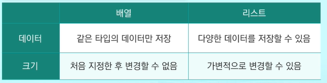

- Sequence 자료형
  - 순서가 존재함, 인덱싱과 슬라이싱의 연산이 가능
  - 인덱싱: 시퀀스 자료형에서 하나의 요소를 인덱스 연산자를 통하여 참조하는 것
  - 슬라이싱: 시퀀스 자료형의 원하는 범위를 선택하는 연산

- 리스트 함축(List comprehension)
  - 수학에서 집합을 정의하는 표현식과 유사함

### 완전검색(Exhaustive Search)

- 문제의 해법으로 생각할 수 있는 모든 경우의 수를 나열해보고 확인하는 기법
  - Brute-force 혹은 Generate-and-Test 기법이라고도 불림
  - 모든 경우의 수를 테스트한 후, 최종 해법을 도출함
  - 일반적으로 경우싀 수가 상대적으로 작을 때 유용함
  - 수행 속도는 느리지만, 정확도가 높다
  - 문제를 풀 때, 우선 완전 탐색으로 해답을 도출 후, 성능 개선을 위해 다른 알고리즘을 사용하고 해답을 확인하는 것이 바람직함

- 순열(Permutation): 서로 다른 것들 중 몇 개를 뽑아서 한 줄로 나열하는 것

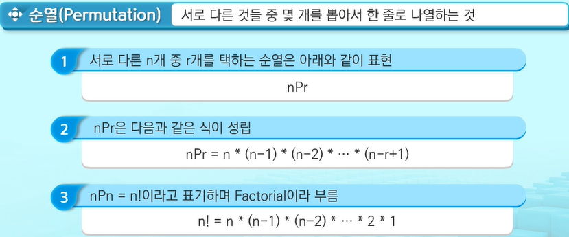

### 탐욕 알고리즘(Greedy Algorithm)

- 최적 해를 구하는데 사용되는 근시안적인 방법

  - 여러 경우 중 하나를 결정해야 할 때마다 그 순간에 최적이라고 생각되는 것을 선택해 나가는 방식으로 진행하여 최종적인 해답에 도달함
  - 각 선택의 시점에서 이루어지는 결정은 지역적으로 최적이지만, 그것들을 계속 수집하여 최종적인 해답을 만들었다고 하여,

  - 일반적으로, 머리속에 떠오르는 생각을 검증 없이 바로 구현하면 Greedy 접근이 됨

- 탐욕 알고리즘의 수행 과정

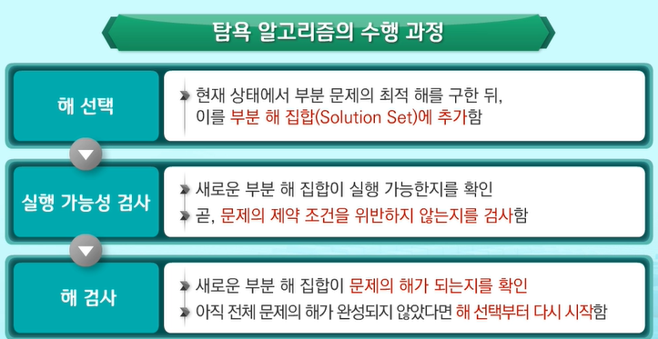

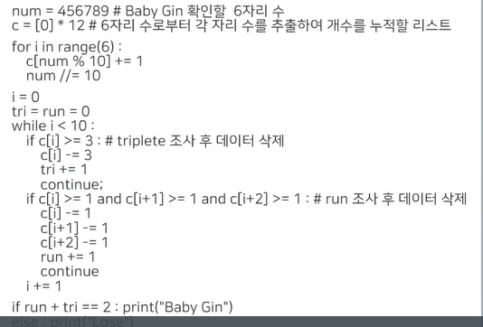

### Sort(정렬)

- 2개 이상의 자료를 특정 기준에 의해 작은 값부터 큰 값 혹은 그 반대의 순서대로 재배열하는 것

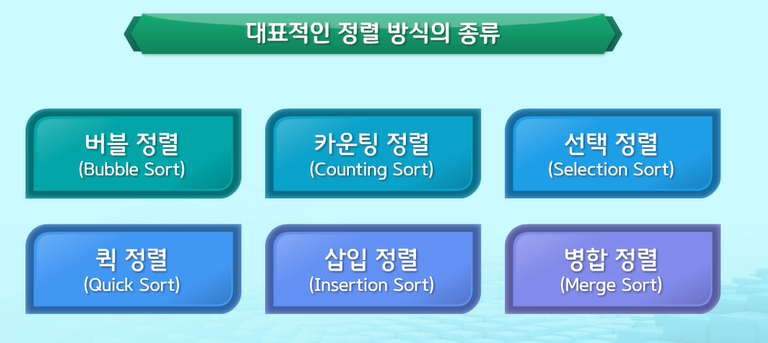

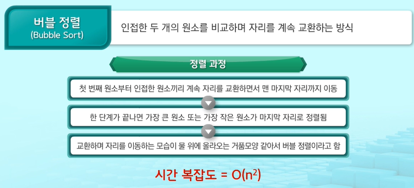

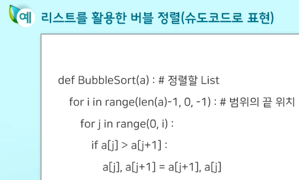

### 카운팅 정렬

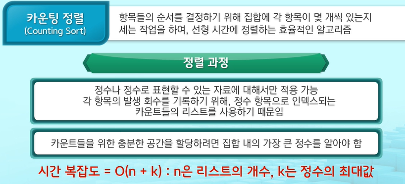


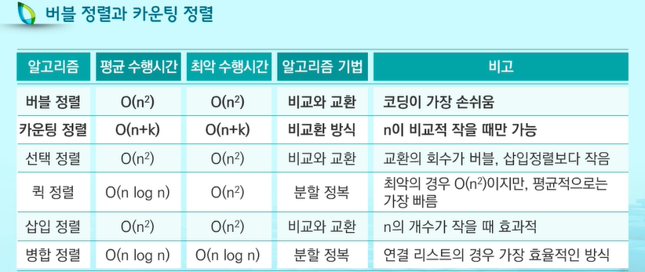

```python
# 버블 정렬 실습
a = [1, 22, 13, 7, 103, 57, 84]

for i in range(len(a) - 1, 0, -1):
    for j in range(i):
        if a[j] > a[j + 1]:
            a[j], a[j + 1] = a[j + 1], a[j]
            
print(a)

# 카운팅 정렬 실습
a = [1, 12, 3, 9, 9, 9, 5, 1, 12, 12, 10, 12]

cnt_a = [0] * (max(a) + 1)
ans_a = [0] * max(a)

for i in a:
    cnt_a[i] += 1

for j in range(1, len(cnt_a)):
    cnt_a[j] += cnt_a[j - 1]


for k in range(len(a) - 1, -1, -1):
    cnt_a[a[k]] -= 1
    ans_a[cnt_a[a[k]]] = a[k]
print(ans_a)

```

