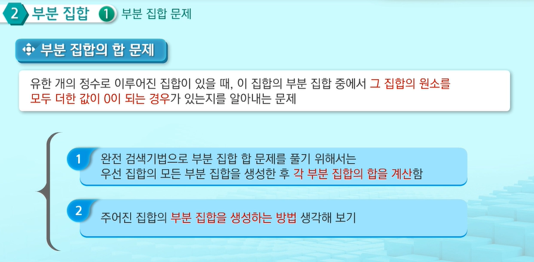
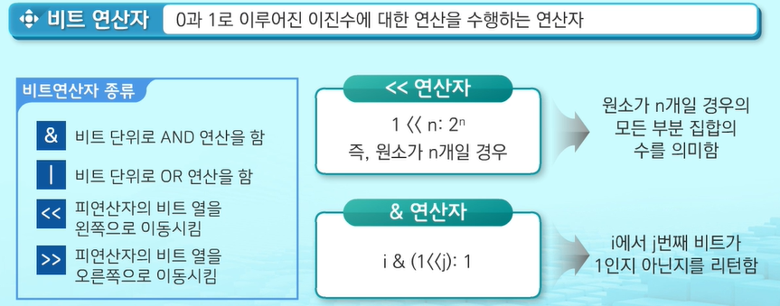
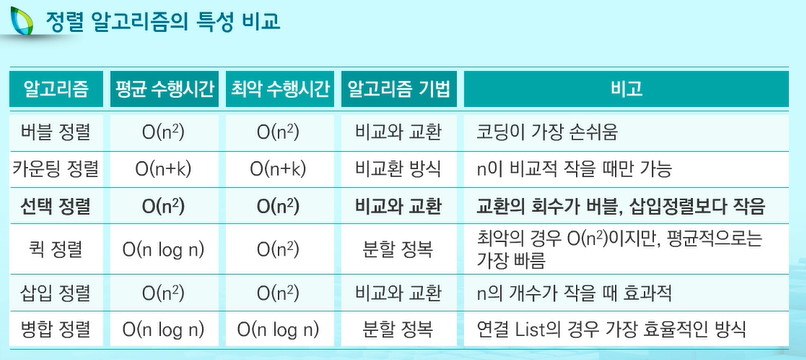

# 2차원 List

- 1차원 List를 묶어놓은 List
- 2차원 이상의 다차원 List는 차원에 따라 Index를 선언
- 2차원 List의 선언: 세로길이(행의 개수), 가로길이(열의 개수)를 필요로 함

- List 초기화
  - 원소를 모두 적어줌
  - List comprehension을 통해 선언
- 2차원 List 입력 받기
  - 행을 먼저 만들어주고 해당 행에 원소들을 입력
  - append를 통해 처음부터 입력
  - 2번째를 List 함축을 활용
- 2차원 List에서 원하는 데이터의 위치 찾기

### 2차원 List의 순회

- n x m List의 n*m개의 모든 원소를 빠짐없이 조사하는 방법
  - 행 우선 순회: 행마다 검사 진행
  - 열 우선 순회: 열마다 검사 진행
  - 지그재그 순회: List의 행을 좌우로 조사하는 방법

```python
# 지그재그 순회 연습
a = [[1, 2, 3, 4], [5, 6, 7, 8], [9, 10, 11, 12]]
for i in range(len(a)):
    for j in range(len(a[0])):
        print(a[i][j + (len(a[0]) - 1 - 2 * j) * (i % 2)])
```

### 델타를 이용한 2차 List 탐색

- 2차 List의 한 좌표에서 네 방향의 인접 List 요소를 탐색할 때 사용하는 방법
- 델타 값은 한 좌표에서 네 방향의 좌표와 x, y의 차이를 저장한 List로 구현
- 델타 값을 이용하여 특정 원소의 상하좌우에 위치한 원소에 접근할 수 있음
  - 이차원 List의 가장자리 원소들은 상하좌우 네 방향에 원소가 존재하지 않을 경우가 있으므로, Index를 체크하거나 Index의 범위를 제한해야 함.

### 전치 행렬

- 행과 열의 값이 반대인 행렬을 의미

```python
# 전치 행렬 실습
from re import A

a = [[1, 2, 3, 4], [5, 6, 7, 8], [9, 10, 11, 12], [13, 14, 15, 16]]

for i in range(len(a)):
    for j in range(len(a[0])):
        if i < j:
            a[i][j], a[j][i] = a[j][i], a[i][j]
print(A)
```

### Zip(iterable)

- 동일한 개수로 이루어진 자료형들을 묶어 주는 역할을 하는 함수

```python
a = [[1, 2, 3], [4, 5, 6], [7, 8, 9]]
print(list(zip(a[0], a[1], a[2])))
# print(list(zip(*a))) 와 같은 의미
# 전치행렬을 더욱 쉽게 구할 수 있음
```

### 부분 집합




```python
# 총 부분집합 구해보기
bit = [0, 0, 0, 0]
for i in range(2):
    bit[0] = i
    for j in range(2):
        bit[1] = j
        for k in range(2):
            bit[2] = k
            for l in range(2):
                bit[3] = l
                print(bit)
```

### 비트 연산자

- 0과 1로 이루어진 이진수에 대한 연산을 수행하는 연산자

| 비트연산자 종류    | 내용                                     |
| ------------------ | ---------------------------------------- |
| &                  | 비트 단위로 AND 연산을 함                |
| \|                 | 비트 단위로 OR 연산을 함                 |
| << (레프트 쉬프트) | 피연산자의 비트 열을 왼쪽으로 이동시킴   |
| >> (라이트 쉬프트) | 피연산자의 비트 열을 오른쪽으로 이동시킴 |



```python
# 비트연산자를 활용한 부분 집합 구하기
arr = [1,2,3] 
for i in range(1<<3): # 공집합을 제외한 모든 부분집합 검사 
    for j in range(3): # arr의 모든 원소 루프
        if i & (1<<j): # i의 j번째 비트 검사, j번째 비트가 1이라면 arr[j] 출력
            print(arr[j], end=' ') # 출력하면 순서가 바뀜에 유의, 다시 말해서 0번째 비트를 검사하면 3의 위치를 검사하는데 arr[j]는 arr[0]을 말한다. 고로 1이 출력됨.
    print()
    
# 단순 반복문과 배열 
a = [1, 2, 3]
subset = [[]]

for i in a:
    for j in range(len(subset)):
        subset.append(subset[j] + [i])

print(subset)
```

### 검색

- 저장되어 있는 자료 중에서 원하는 항목을 찾는 작업
  - 목적하는 탐색키를 가진 항목
    - 탐색키(Search key): 자료를 구별하여 인식할 수 있는 키
- 검색의 종류
  - 순차 검색(Sequential Search)
  - 이진 검색(Binary Search)
  - 인덱싱(Indexing)
- 순차 검색( 시간 복잡도 O(n))
  - 일렬로 되어 있는 자료를 순서대로 검색하는 방법
  - List나 연결 List 등 순차구조로 구현된 자료구조에서 유용함
  - 구현이 쉽지만, 검색 대상이 많은 경우 수행시간의 증가로 비효율적임
  - 2자기 경우(정렬된 경우, 정렬되지 않은 경우)


- 이진 검색
  - 효율적인 검색 방법
  - 자료의 가운데 항목의 키 값과 비교하여 다음 검색의 위치를 결정하고 검색을 계속하는 방법
    - 목적 키를 찾을 때까지 이진 검색을 순환적으로 반복 수행함으로써 검색 범위를 반으로 줄여가면서 빠르게 검색을 수행함
    - 단, 이진 검색을 하기 위해서는 자료가 정렬된 상태여야 함
    - 정렬된 데이터 n개가 있는 경우의 시간복잡도
      - 순차 검색 시 O(N)의 시간이 걸리지만, 이진 검색 시 O(lonN)의 시간이 걸림
  - 검색 범위의 시작점과 종료점을 이용하여 검색을 반복 수행함
  - 이진 검색의 경우, 자료에 삽입이나 삭제가 발생하였을 때 List의 상태를 항상 정렬 상태로 유지하는 추가 작업이 필요함

```python
start = 0
end = len(a) - 1
while start <= end:
    middle = start + (end - start) // 2
    if key == a[middle]:
        return True
    elif key < a[middle]:
        end = middle - 1
    else:
        start = middle + 1
return False

# 재귀 함수를 이용한 이진 검색 구현
def binarySearch2(a, low, high, key):
    if low > high:
        return False
    else:
        middle = (low + high) // 2
        if key == a[middle]:
            return True
        elif key < a[middle]:
            return binarySearch2(a, low, middle - 1, key)
        elif key > a[middle]:
            return binarySearch2(a, middle + 1, high , key)
```

- 인덱스
  - 데이터베이스에서 유래, 테이블에 대한 동작 속도를 높임
  - 룩 업 테이블 등의 용어로 사용함
  - 인덱스를 저장하는데 필요한 디스크 공간은 보통 테이블 저장에 필요한 디스크 공간보다 작음
    - 인덱스는 키-필드만 갖고 있고, 테이블의 다른 세부 항목은 갖고 있지 않음
  - List를 사용한 인덱스
    - 대량의 데이터를 매번 정렬하면, 프로그램의 반응은 느려질 수밖에 없음. 이러한 대량 데이터의 성능 저하 문제를 해결하기 위해 List 인덱스를 사용할 수 있음

### 정렬

- 셀렉션 알고리즘
  - 저장되어 있는 자료로부터 k번째로 큰 혹은 작은 원소를 찾는 방법
  - 최소값, 최대값 혹은 중간값을 찾는 알고리즘을 의미하기도 함

```python
# k 번째로 작은 원소를 찾아오는 알고리즘
# 1번부터 k번째까지 작은 원소들을 찾아 List의 앞쪽으로 이동시키고, List의 k번째를 반환
# k가 비교적 작을 때 유용하며 O(kn)의 수행시간을 필요로 함
def select(list, k):
    for i in range(k):
        minindex = i
        for j in range(i + 1, len(list)):
            if list[minindex] > list[j]:
                minindex = j
            list[i], list[minindex] = list[minindex], list[i]
    return list[k - 1]        
```

### 선택 정렬(O(n^2))

- 주어진 자료들 중 가장 작은 값의 원소부터 차례대로 선택하여 위치를 교환하는 방식
- 셀렉션 알고리즘을 전체 자료에 적용한 것
- 정렬 과정
  - 주어진 List 중에서 최소값을 찾음
  - 그 값을 List의 맨 앞에 위치한 값과 교환
  - 맨 처음 위치를 제외한 나머지 List를 대상으로 위의 과정을 반복

```python
# 선택 정렬 슈도 코드
def selectionSort(a):
    for i in range(0, len(a) - 1):
        min = i
        for j in range(i + 1, len(a)):
            if a[min] > a[j]:
                min = j
        a[i], a[min] = a[min], a[i]
```

